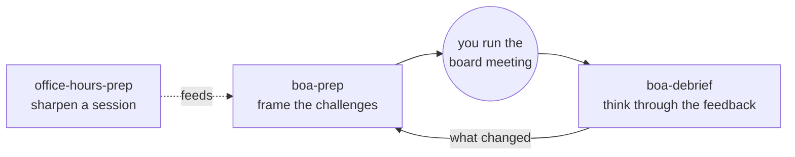

# StartX BoA AI Skills (1SF)

The `/skills/1SF/` folder: the StartX-related skills [Adam McGinty](https://github.com/1SF) contributes to this catalog. While these skills can be used individually or together outside the context of StartX, they are designed to be used together in loops over the course of a StartX startup program. Wishing you good luck building something great!

**One loop, not three tools.** A StartX BoA runs three board meetings a session. These skills help you think your way around each one: sharpen what you bring, get clear on the challenges to put to the board, then work through the board's input afterward and carry it into the next meeting. They help you prepare and reflect; they do not run your meetings, record them, or make the calls for you.



## Which skill, when

| Skill | When | How it helps | Status |
|---|---|---|---|
| [startx-office-hours-prep](startx-office-hours-prep/) | Before office hours or a mentor 1:1 | Sharpens your framing and your ask; you leave with a prep doc and a mentor-note outline to write from | v1.2 |
| [startx-boa-prep](startx-boa-prep/) | Before a Board of Advisors meeting | Pressure-tests the company with you; you leave with a pre-read and a 2-3 challenge agenda | v1.2 |
| [startx-boa-debrief](startx-boa-debrief/) | Right after a BoA meeting | Helps you think through the board's input; you leave with a follow-up outline to write from and a handoff into the next pre-read | v1.0 |

New to the board: start with **startx-boa-prep**, and use **startx-office-hours-prep** for sessions in between.

## Install

```
/plugin marketplace add startx-founders/claude-skills
/plugin install startx-office-hours-prep@startx-founders
/plugin install startx-boa-prep@startx-founders
/plugin install startx-boa-debrief@startx-founders
```

## Shared posture

Each skill is intended to help sharpen the founder's thinking; not replace it (no decisions made for you, no invented evidence). Developed and released by [Adam McGinty](https://github.com/1SF); not affiliated with, endorsed by, or audited by StartX or Anthropic. These skills, and anything they produce, are not legal, medical, or financial advice; see each skill's README for the full disclaimer. MIT; each skill carries its own LICENSE.
